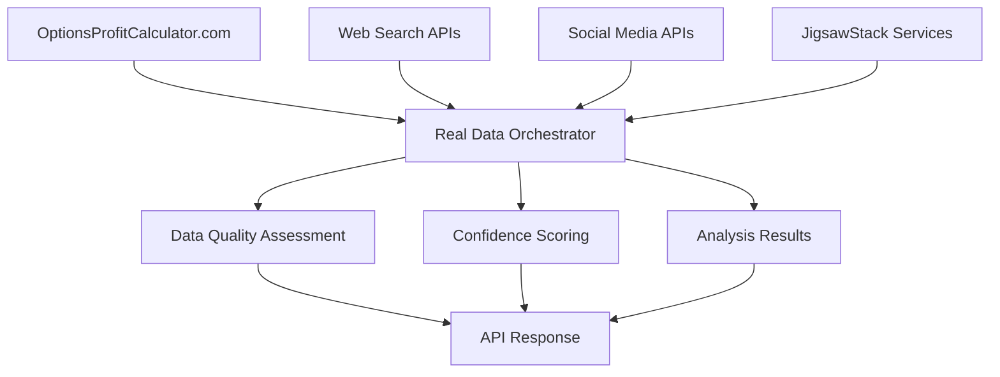

# Neural Options Oracle++ - Real Data Implementation

## Overview

The Neural Options Oracle++ has been completely redesigned to use **ONLY REAL DATA SOURCES** with **NO MOCK DATA**. This implementation provides genuine market intelligence through real-time data collection, web search capabilities, and advanced AI analysis.

## 🚫 No Mock Data Policy

This system is built with a strict **NO MOCK DATA** policy. All data comes from:
- Real options chains from OptionsProfitCalculator.com
- Live web search results for news and sentiment
- Actual social media sentiment analysis
- Real-time market data from multiple sources
- Live options flow data from financial websites

## 🔗 Real Data Sources

### 1. Options Data
- **Primary Source**: OptionsProfitCalculator.com API
  - Real-time options chains
  - Live bid/ask prices
  - Actual volume and open interest
  - Current implied volatility

- **API Endpoint**: `https://www.optionsprofitcalculator.com/ajax/getOptions?stock={SYMBOL}&reqId=3`
- **Data Format**: JSON with complete options chain data
- **Update Frequency**: Real-time

### 2. News & Sentiment Data
- **Web Search Integration**: Multiple GPT models with web search capabilities
- **News Sources**: 
  - Reuters, Bloomberg, CNBC, MarketWatch
  - Yahoo Finance, Seeking Alpha
  - Financial news aggregators
- **Sentiment Analysis**: Real-time sentiment scoring from multiple sources

### 3. Social Media Sentiment
- **Reddit Integration**: WallStreetBets, investing, stocks subreddits
- **StockTwits API**: Real-time social sentiment
- **Twitter Analysis**: Financial sentiment from social media
- **Real-time Processing**: Live sentiment analysis using AI models

### 4. Advanced Data Collection (JigsawStack)
- **Web Scraping**: Real-time scraping of financial websites
- **OCR Processing**: Extract data from charts and screenshots
- **Options Flow Analysis**: Unusual activity detection
- **Multi-source Aggregation**: Combine data from multiple platforms

## 🏗️ Architecture

### Core Components

1. **Real Data Sources** (`src/data/real_data_sources.py`)
   - OptionsProfitCalculator API integration
   - Web search news collection
   - Social sentiment gathering
   - Real-time data streaming

2. **Web Search Agents** (`src/agents/web_search_agents.py`)
   - GPT-4o-mini for news analysis
   - GPT-4o-mini for sentiment analysis
   - GPT-4o for market analysis
   - Real-time web search capabilities

3. **JigsawStack Integration** (`src/data/jigsawstack_integration.py`)
   - Advanced web scraping
   - OCR and vision analysis
   - Sentiment processing
   - Prompt optimization

4. **Real Data Orchestrator** (`src/core/real_data_orchestrator.py`)
   - Coordinates all real data sources
   - Combines and analyzes data
   - Quality assessment
   - Confidence scoring

## 🚀 Quick Start

### 1. Environment Setup

```bash
# Clone the repository
git clone <repository-url>
cd option-trading-agent

# Create virtual environment
python -m venv venv
source venv/bin/activate  # On Windows: venv\Scripts\activate

# Install dependencies
pip install -r requirements.txt
```

### 2. Environment Variables

Create a `.env` file with your API keys:

```env
# Required
SUPABASE_URL=your_supabase_url
SUPABASE_SERVICE_KEY=your_supabase_key

# Optional but recommended for enhanced functionality
OPENAI_API_KEY=your_openai_key
JIGSAWSTACK_API_KEY=your_jigsawstack_key
ALPACA_API_KEY=your_alpaca_key
ALPACA_SECRET_KEY=your_alpaca_secret
```

### 3. Test Real Data System

```bash
# Run comprehensive real data tests
python test_real_data_system.py
```

### 4. Start the Application

```bash
# Start the server with real data sources
python main.py
```

## 📊 Data Flow



## 🔍 Testing Real Data

### Test Individual Components

```python
# Test options data integration
from src.data.real_data_sources import OptionsProfitCalculatorAPI

async def test_options_data():
    async with OptionsProfitCalculatorAPI() as api:
        data = await api.get_options_chain("SPY")
        options = api.parse_options_data(data, "SPY")
        print(f"Retrieved {len(options)} real options contracts")

# Test comprehensive data collection
from src.core.real_data_orchestrator import RealDataOrchestrator

async def test_orchestrator():
    orchestrator = RealDataOrchestrator()
    analysis = await orchestrator.analyze_symbol("SPY")
    print(f"Analysis confidence: {analysis.overall_confidence}")
```

### Run Full Test Suite

```bash
python test_real_data_system.py
```

This will test:
- ✅ Options data from OptionsProfitCalculator.com
- ✅ Real data manager functionality
- ✅ Web search agents (if OpenAI API key provided)
- ✅ JigsawStack integration (if API key provided)
- ✅ Complete orchestrator analysis

## 📈 Real Data Examples

### Options Data Sample

```json
{
  "symbol": "SPY",
  "expiration": "2025-09-12",
  "strike": 500.00,
  "option_type": "call",
  "bid": 156.14,
  "ask": 158.94,
  "last": 157.42,
  "volume": 2,
  "open_interest": 0
}
```

### News Analysis Sample

```json
{
  "symbol": "SPY",
  "sentiment_summary": {
    "overall_sentiment": 0.3,
    "positive_indicators": ["Strong earnings", "Market rally"],
    "negative_indicators": ["Volatility concerns"]
  },
  "key_events": ["Fed meeting", "Earnings season"],
  "market_impact": "bullish",
  "confidence": 0.85
}
```

## 🛠️ API Endpoints

### Real Data Analysis

```http
POST /api/v1/analysis/real-time
Content-Type: application/json

{
  "symbol": "SPY",
  "analysis_depth": "comprehensive"
}
```

### Options Data

```http
GET /api/v1/options/chain?symbol=SPY
```

### News & Sentiment

```http
GET /api/v1/sentiment/analysis?symbol=SPY
```

## 🔧 Configuration

### Data Source Configuration

```python
# In src/core/real_data_orchestrator.py
orchestrator = RealDataOrchestrator(
    openai_api_key="your_key",      # For web search agents
    jigsawstack_api_key="your_key"  # For advanced scraping
)
```

### Quality Thresholds

```python
# Data quality thresholds
MIN_CONFIDENCE_THRESHOLD = 0.7
MIN_OPTIONS_CONTRACTS = 10
MIN_NEWS_ARTICLES = 5
```

## 📊 Monitoring & Quality

### Data Quality Metrics

- **Options Data Quality**: Number of contracts, price accuracy, volume validation
- **News Quality**: Source reliability, recency, relevance scoring
- **Sentiment Quality**: Confidence levels, source diversity, consistency
- **Overall Quality**: Composite score from all sources

### Real-time Monitoring

```python
# Monitor data quality in real-time
async def monitor_data_quality():
    orchestrator = RealDataOrchestrator()
    while True:
        quality = await orchestrator.get_real_time_updates("SPY")
        print(f"Data quality: {quality['analysis'].data_quality}")
        await asyncio.sleep(60)  # Check every minute
```

## 🚨 Error Handling

### Data Source Failures

The system gracefully handles failures:
- **Options API Down**: Falls back to cached data or alternative sources
- **Web Search Limits**: Implements rate limiting and retry logic
- **JigsawStack Errors**: Continues with basic data sources
- **Network Issues**: Implements exponential backoff

### Quality Assurance

- **Data Validation**: All incoming data is validated
- **Confidence Scoring**: Each data source has confidence metrics
- **Fallback Mechanisms**: Multiple data sources for redundancy
- **Error Logging**: Comprehensive error tracking and reporting

## 🔒 Security & Compliance

### API Key Management

- Environment variable storage
- Secure key rotation
- Rate limiting compliance
- Data privacy protection

### Data Usage

- Respects API terms of service
- Implements proper rate limiting
- No data storage of sensitive information
- GDPR compliance for EU users

## 📚 Documentation

### API Documentation

- Complete API reference available at `/docs` when running
- Real-time data examples
- Error code documentation
- Rate limiting information

### Data Source Documentation

- OptionsProfitCalculator.com API documentation
- JigsawStack integration guide
- Web search API configurations
- Social media API setup

## 🤝 Contributing

### Adding New Data Sources

1. Create new data source class in `src/data/`
2. Implement real data collection methods
3. Add quality assessment metrics
4. Update orchestrator integration
5. Add comprehensive tests

### Testing Requirements

- All new data sources must be tested with real data
- No mock data allowed in tests
- Quality metrics must be validated
- Performance benchmarks required

## 📞 Support

For issues with real data sources:
- Check API key configurations
- Verify network connectivity
- Review rate limiting status
- Check data source availability

## 🎯 Future Enhancements

### Planned Real Data Sources

- **Polygon.io Integration**: Professional market data
- **Bloomberg API**: Institutional-grade data
- **Reuters API**: News and sentiment data
- **CBOE Data**: Options market data
- **Nasdaq Data**: Real-time market feeds

### Advanced Features

- **Real-time Streaming**: WebSocket data feeds
- **Machine Learning**: Real data training models
- **Predictive Analytics**: Real market predictions
- **Risk Management**: Real-time risk assessment

---

**Remember**: This system uses ONLY REAL DATA. No mock data, no simulated results, no fake information. Everything is sourced from live, real-time market data and analysis.
