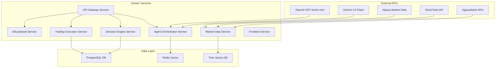

# Neural Options Oracle++ - Technical Blueprint

## System Overview

The Neural Options Oracle++ is a cloud-based AI trading platform using OpenAI and Gemini models for intelligent options trading signals and education. This blueprint outlines the complete technical implementation using Docker microservices.

## Core Architecture Principles

1. **Cloud-First AI Models**: OpenAI GPT-4o, GPT-4o-mini, Gemini 2.0 Flash
2. **Microservices Architecture**: Docker-based containerized services
3. **Real-Time Data**: WebSocket connections for live market data
4. **Educational Focus**: Adaptive learning system with explanations
5. **Risk Management**: Built-in position monitoring and limits
6. **Paper Trading**: Alpaca paper trading integration

## High-Level System Architecture



## Service Architecture

### 1. API Gateway Service (Port 8080)
- FastAPI-based central routing
- Authentication & rate limiting
- WebSocket management for real-time updates
- Load balancing to internal services

### 2. Agent Orchestrator Service (Port 8081)
- OpenAI Agents SDK implementation
- Multi-agent coordination (Technical, Sentiment, Flow, Risk, Education)
- Dynamic weight assignment based on market scenarios
- Agent communication and handoffs

### 3. Market Data Service (Port 8082)
- Real-time data streaming from Alpaca
- StockTwits trending stocks integration
- JigsawStack data enhancement
- Data normalization and caching

### 4. Decision Engine Service (Port 8083)
- Scenario detection and classification
- Dynamic weight calculation
- Signal generation (BUY/SELL/HOLD)
- Risk-based strike selection

### 5. Trading Execution Service (Port 8084)
- Alpaca paper trading integration
- Position management and monitoring
- Real-time P&L tracking
- Risk limits enforcement

### 6. Educational Service (Port 8085)
- Adaptive learning content generation
- Trade explanation engine
- Interactive strategy simulator
- Progress tracking and quizzes

### 7. Frontend Service (Port 3000)
- Next.js React application
- 3D visualizations with Three.js
- Real-time WebSocket connections
- Responsive trading dashboard

## Data Architecture

### Redis Cache (Port 6379)
- Real-time market data caching
- Session management
- Agent communication buffer
- WebSocket connection state

### PostgreSQL Database (Port 5432)
```sql
-- Core tables
users (id, email, risk_profile, settings)
stocks (symbol, company_name, sector, market_cap)
trading_signals (id, symbol, direction, score, timestamp, agent_weights)
positions (id, user_id, symbol, option_type, strike, expiration, quantity, entry_price)
educational_progress (user_id, topic, completion_rate, quiz_scores)
```

### Time Series Database (InfluxDB Port 8086)
- Market price data
- Options Greeks historical data
- Portfolio performance metrics
- Real-time P&L tracking

## AI Agent System

### Technical Analysis Agent (OpenAI GPT-4o)
**Weight: 60% of final decision**
```python
# Dynamic scenario-based weighting
scenarios = {
    "strong_uptrend": {"ma": 0.30, "rsi": 0.15, "bb": 0.10, "macd": 0.25, "vwap": 0.20},
    "strong_downtrend": {"ma": 0.30, "rsi": 0.15, "bb": 0.10, "macd": 0.25, "vwap": 0.20},
    "range_bound": {"ma": 0.15, "rsi": 0.25, "bb": 0.30, "macd": 0.15, "vwap": 0.15},
    "breakout": {"ma": 0.20, "rsi": 0.15, "bb": 0.30, "macd": 0.20, "vwap": 0.15},
    "potential_reversal": {"ma": 0.15, "rsi": 0.25, "bb": 0.20, "macd": 0.30, "vwap": 0.10}
}
```

### Sentiment Analysis Agent (OpenAI GPT-4o-mini)
**Weight: 10% of final decision**
- Social media sentiment (Reddit, Twitter, StockTwits)
- News sentiment analysis via JigsawStack
- FinBERT financial sentiment scoring

### Options Flow Agent (Gemini 2.0 Flash)
**Weight: 10% of final decision**
- Put/call ratio analysis
- Unusual volume detection
- Large block trade identification
- Gamma exposure calculations

### Historical Pattern Agent (OpenAI GPT-4o)
**Weight: 20% of final decision**
- Pattern recognition and classification
- Mean reversion analysis
- Momentum indicators
- Seasonal trends

### Risk Management Agent (OpenAI GPT-4o)
- Real-time portfolio risk assessment
- Position size validation
- Greeks exposure monitoring
- Auto-hedging recommendations

### Education Agent (OpenAI GPT-4o-mini)
- Personalized learning content generation
- Trade decision explanations
- Interactive strategy simulations
- Adaptive curriculum based on performance

## Implementation Files Structure

```
neural-options-oracle/
├── TECHNICAL_BLUEPRINT.md           # This file
├── IMPLEMENTATION_PLAN.md           # Detailed implementation roadmap
├── ARCHITECTURE_DETAILS.md          # Deep technical specifications
├── API_SPECIFICATIONS.md            # Complete API documentation
├── DOCKER_DEPLOYMENT.md             # Docker setup and deployment
├── DATABASE_SCHEMA.md               # Database design and schemas
├── FRONTEND_ARCHITECTURE.md         # Frontend technical details
├── AI_AGENT_IMPLEMENTATION.md       # AI agents technical specs
├── SECURITY_COMPLIANCE.md           # Security and compliance measures
└── TESTING_STRATEGY.md              # Testing approach and frameworks
```

## Key Technical Decisions

### 1. AI Model Selection
- **OpenAI GPT-4o**: Primary analysis agent (complex reasoning)
- **OpenAI GPT-4o-mini**: Sentiment/education agents (cost-effective)
- **Gemini 2.0 Flash**: Options flow agent (speed for real-time data)

### 2. Architecture Patterns
- **Microservices**: Independent, scalable services
- **Event-Driven**: WebSocket real-time updates
- **CQRS**: Command Query Responsibility Segregation for data
- **Circuit Breaker**: API resilience patterns

### 3. Technology Stack
```yaml
Backend:
  - Python 3.11+ with FastAPI
  - OpenAI Python SDK
  - Google AI Python SDK (Gemini)
  - Alpaca Trade API
  - Redis for caching
  - PostgreSQL for persistence

Frontend:
  - Next.js 14 with TypeScript
  - Three.js for 3D visualizations
  - Recharts for financial charts
  - Socket.IO for real-time updates
  - Tailwind CSS for styling

DevOps:
  - Docker & Docker Compose
  - Nginx reverse proxy
  - GitHub Actions CI/CD
  - Monitoring with Prometheus/Grafana
```

## Scalability Considerations

### Horizontal Scaling
- Each service can be independently scaled
- Load balancer distribution
- Database read replicas
- Redis clustering for high availability

### Performance Optimization
- API response caching with Redis
- Database query optimization
- WebSocket connection pooling
- Async/await patterns throughout

### Cost Optimization
- Strategic use of GPT-4o vs GPT-4o-mini
- Efficient API call patterns
- Data caching to reduce external API calls
- Resource-based Docker container sizing

## Security Architecture

### Authentication & Authorization
- JWT-based authentication
- Role-based access control (RBAC)
- API key management for external services
- Rate limiting per user/endpoint

### Data Security
- Encryption at rest (database)
- TLS/SSL for data in transit
- API key rotation policies
- Audit logging for all trades

### Compliance Considerations
- No real money trading (paper only)
- Educational disclaimer requirements
- User data privacy (GDPR compliance)
- Financial advice disclaimers

## Deployment Strategy

### Development Environment
```bash
# Single command setup
docker-compose -f docker-compose.dev.yml up -d
```

### Production Environment
```bash
# Production deployment with monitoring
docker-compose -f docker-compose.prod.yml up -d
```

### Monitoring & Observability
- Application performance monitoring (APM)
- Real-time error tracking
- Business metrics dashboards
- Alert systems for system failures

This blueprint serves as the foundation for the complete Neural Options Oracle++ implementation, ensuring scalable, maintainable, and educational-focused options trading platform.