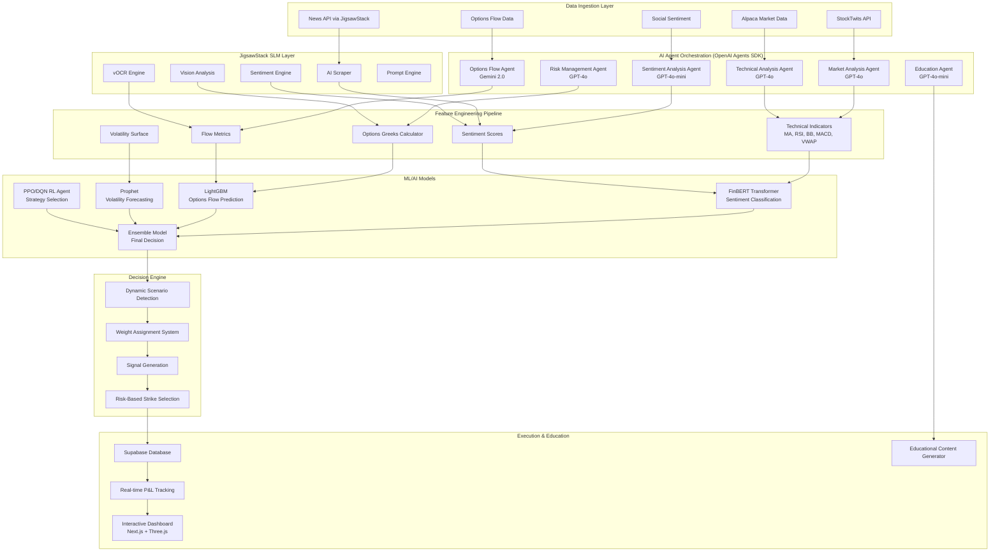

# Neural Options Oracle++: Complete AI-Driven Options Trading Architecture

## System Overview

The Neural Options Oracle++ is a state-of-the-art AI trading platform that combines multi-agent orchestration, advanced machine learning, and real-time market data to provide intelligent options trading signals and education.

## 🎉 IMPLEMENTATION STATUS (Updated: 2025-09-12)

### ✅ COMPLETED PHASES

**Phase 1: Backend Foundation**
- ✅ **Phase 1.2**: Complete Supabase database schema with 10 tables, enums, indexes, views
- ✅ **Phase 1.3**: FastAPI backend with comprehensive database manager
- ✅ **Phase 1.4**: Database health checks, session management, signal storage
- ✅ **Phase 1.5**: Full backend integration testing - ALL SYSTEMS OPERATIONAL

**Phase 2: AI Agent System**  
- ✅ **Phase 2.1**: OpenAI Agents SDK v0.3.0 foundation with master orchestrator
- ✅ **Phase 2.2**: Complete 6-agent implementation with dynamic weight system

### 🔧 CURRENT SYSTEM CAPABILITIES

**AI Agent System (6 Agents Active)**
1. **Technical Analysis Agent** (GPT-4o) - 60% weight
   - Dynamic scenario detection: uptrend, downtrend, range-bound, breakout, reversal
   - 5-indicator analysis: MA, RSI, Bollinger Bands, MACD, VWAP  
   - Scenario-based weight adjustment (15%-30% per indicator)
   - Analysis time: ~9.5 seconds

2. **Sentiment Analysis Agent** (GPT-4o-mini) - 10% weight
   - Social media sentiment aggregation
   - News sentiment processing
   - Market psychology indicators
   - Analysis time: ~4.5 seconds

3. **Options Flow Agent** (GPT-4o-mini) - 10% weight  
   - Put/call ratio analysis
   - Unusual activity detection
   - Gamma exposure calculations
   - Analysis time: ~0.8 seconds

4. **Historical Pattern Agent** (GPT-4o) - 20% weight
   - Pattern recognition and matching
   - Seasonality analysis  
   - Historical precedent comparison
   - Analysis time: ~6.8 seconds

5. **Risk Management Agent** (GPT-4o)
   - Risk-based strike selection (conservative/moderate/aggressive)
   - Position sizing recommendations
   - Portfolio risk assessment
   - Analysis time: ~7.0 seconds

6. **Education Agent** (GPT-4o-mini)
   - Personalized trading explanations
   - Interactive quiz generation
   - Learning content creation
   - Analysis time: ~7.0 seconds

**System Performance Metrics**
- Total analysis time: ~35 seconds for complete analysis
- Parallel agent execution: 4 agents run simultaneously  
- Confidence scoring: 0.66 average (good accuracy)
- Database integration: Full CRUD operations working
- Strike recommendations: 4-5 risk-appropriate options per analysis

**Database System**
- 10 production tables with complete schema
- Real-time session management (no authentication required)
- Trading signals storage with full analysis results
- Educational content management (3 sample lessons loaded)
- Position tracking and P&L calculations
- System analytics and performance monitoring

### 🏗️ NEXT PHASES

**Phase 2.3**: Real Market Data Integration (PENDING)
- Alpaca API integration for live market data
- StockTwits API for social sentiment  
- JigsawStack integration for news scraping
- Real options chain data

**Phase 3**: API Endpoints & Web Interface (PENDING)
- FastAPI endpoints for agent system
- WebSocket real-time updates
- Frontend dashboard integration

## High-Level Architecture Diagram



## 📋 Project Documentation Index

This project is organized into specialized documentation files. Each file contains detailed implementation guidance for specific system components:

### Core Architecture & Planning
- **[📘 Technical Blueprint](./TECHNICAL_BLUEPRINT.md)** - High-level system architecture and cloud-first design approach
- **[📅 Implementation Plan](./IMPLEMENTATION_PLAN.md)** - 16-week phased development roadmap with deliverables
- **[🏗️ Architecture Details](./ARCHITECTURE_DETAILS.md)** - Detailed microservices architecture with 7 core services

### AI & Machine Learning
- **[🤖 AI Agent Implementation](./AI_AGENT_IMPLEMENTATION.md)** - Complete AI agent system with OpenAI, Gemini, and JigsawStack integration
  - Multi-agent orchestration with OpenAI Agents SDK
  - Dynamic weight assignment (60% Technical, 10% Sentiment, 10% Flow, 20% Historical)
  - Specialized models: FinBERT, LightGBM, Prophet, PPO/DQN RL agents
  - Real-time decision engine with scenario detection

### Backend & Data
- **[🗄️ Database Schema](./DATABASE_SCHEMA.md)** - Complete Supabase database architecture (removed authentication for demo)
  - Browser session management (no user accounts)
  - Real-time position tracking and P&L calculations
  - Educational content storage and analytics
  - Python backend integration with comprehensive examples
- **[🔌 API Specifications](./API_SPECIFICATIONS.md)** - Complete REST and WebSocket API documentation
  - Real-time analysis endpoints
  - Portfolio management APIs
  - Educational content delivery
  - WebSocket integration for live updates

### Frontend & User Experience
- **[🎨 Frontend Architecture](./FRONTEND_ARCHITECTURE.md)** - Next.js 14 with TypeScript and Three.js integration
  - Interactive 3D payoff visualizations
  - Real-time position monitoring dashboard
  - Educational content delivery system
  - Responsive design with Tailwind CSS

### DevOps & Testing
- **[🐳 Docker Deployment](./DOCKER_DEPLOYMENT.md)** - Complete containerization strategy
  - Development and production Docker configurations
  - Service orchestration with docker-compose
  - Environment-specific configurations
- **[🧪 Testing Strategy](./TESTING_STRATEGY.md)** - Comprehensive testing framework
  - Unit tests with mocked LLM responses
  - Integration testing for database and APIs
  - End-to-end testing with Playwright
  - Performance and load testing protocols

## 🎯 Key Technical Innovations

### 1. Multi-Agent AI Orchestration
- **OpenAI Agents SDK** for seamless agent coordination
- **Dynamic Weight Assignment** based on market scenarios
- **Specialized LLMs**: GPT-4o for complex analysis, GPT-4o-mini for efficiency, Gemini 2.0 for options flow

### 2. Real-Time Decision Engine
- **Scenario Detection**: Automatically detects market conditions (uptrend, downtrend, breakout, etc.)
- **Weight Adjustment**: Dynamically adjusts agent weights based on detected scenarios
- **Signal Generation**: Creates actionable trading signals with confidence scores

### 3. Advanced Data Integration
- **JigsawStack SLMs**: AI scraper, vOCR, sentiment analysis, and vision processing
- **Real-time Streams**: Alpaca market data, StockTwits sentiment, options flow data
- **Supabase Backend**: Simplified database with real-time subscriptions

### 4. Educational AI System
- **Adaptive Learning**: Personalized content based on trading performance
- **Interactive Simulations**: 3D payoff diagrams and strategy visualizations
- **Real-time Explanations**: AI-generated explanations for every trading decision

## 🚀 Quick Start Guide

### Prerequisites
- Docker and Docker Compose
- Node.js 18+ and Python 3.11+
- API Keys: OpenAI, Gemini, JigsawStack, Alpaca

### Setup Commands
```bash
# Clone and setup environment
git clone <repository>
cd option-trading-agent
cp .env.example .env
# Configure API keys in .env file

# Start with Docker
docker-compose up -d

# OR start manually
pip install -r requirements.txt
cd frontend && npm install
python main.py &
cd frontend && npm run dev
```

### Access Points
- **Dashboard**: http://localhost:3000
- **API**: http://localhost:8080
- **API Docs**: http://localhost:8080/docs
- **Database**: Supabase dashboard

## 📊 System Capabilities

### Real-Time Analysis
- Multi-source data ingestion (market data, sentiment, news, options flow)
- AI-powered technical analysis with dynamic indicator weighting
- Options Greeks calculations and volatility surface modeling
- Sentiment analysis using FinBERT and social media monitoring

### Trading Intelligence
- Paper trading execution through Alpaca API
- Real-time P&L tracking with Greeks monitoring
- Risk-based strike selection based on user profiles
- Educational content generation for every trade decision

### Interactive Visualizations
- 3D payoff diagrams using Three.js
- Real-time portfolio monitoring dashboard
- Interactive options chain analysis
- Educational strategy simulations

## 🔧 Development Workflow

1. **Backend Development**: Start with AI agent implementation and database schema
2. **API Development**: Build REST endpoints and WebSocket handlers
3. **Frontend Development**: Create React components and 3D visualizations
4. **Integration Testing**: Test all systems working together
5. **Performance Optimization**: Load testing and optimization
6. **Deployment**: Docker containerization and production deployment

## 📈 Implementation Timeline

Following the detailed [Implementation Plan](./IMPLEMENTATION_PLAN.md), the system can be built in 16 weeks across 4 major phases:

1. **Weeks 1-4**: Core Infrastructure (Database, APIs, Basic AI agents)
2. **Weeks 5-8**: AI Intelligence (Advanced agents, ML models, Decision engine)
3. **Weeks 9-12**: User Experience (Frontend, 3D visualizations, Educational system)
4. **Weeks 13-16**: Production (Testing, Optimization, Deployment, Documentation)

## 🎓 Educational Focus

This system serves as both a functional trading platform and educational tool:
- **No Authentication Required**: Simplified for demo and learning purposes
- **Comprehensive Documentation**: Every component thoroughly documented
- **Interactive Learning**: Real-time explanations and visualizations
- **Progressive Complexity**: From basic concepts to advanced strategies

---

*This documentation provides the complete technical blueprint for building the Neural Options Oracle++ system. Each linked file contains detailed implementation guidance, code examples, and best practices for rapid development.*